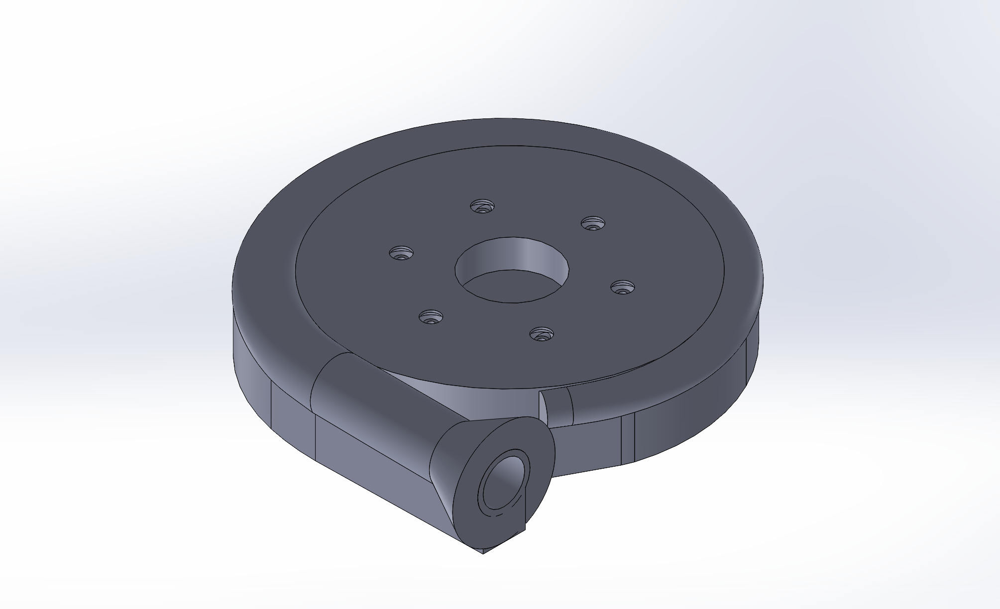

# Staged-Combustion-Project-
This repository will document my contributions to OSU Liquid Rocket Systems' next-generation staged combustion engine

I joined the staged combustion project in August of 2025 with nearly zero experience in Liquid propulsion systems design. 
This documents my journey to becoming an excellent propulsion engineer.

The first thing I did to officially join the team was to complete a CFD challenge, where I was meant to simulate a bell nozzle of a previous engine. 
I completed this sim as a means to learn about ANSYS Fluent and how bell nozzles work. 

-OXYGEN RICH RING PRE-BURNER   
    
    Upon joining the team, I was assigned to the Staged Combustion Project, 
     More specifically, I was assigned to design the pre-burner.

     At this point, I realized that I was in way over my head, 
     and decided to take every challenge head-on and learn as much as possible. 

-Injectors

    When designing injectors for the pre-burner, we decided to choose coaxial swirl injectors, as a senior member One 
    of the Liquid Rocket systems had made a tool to help size coaxial swirl injectors.
    Initially, I thought I could use this tool, and it would give dimensions of an optimal, fully functioning swirl injector. 
    I was very wrong and ended up making dozens of different geometries with only one that actually worked.
    It took me about 3 months of consistent design, simulation, physical testing, and iteration to finally find success. 
    Unfortunately, the day after I created the injector that worked, my entire hard drive was wiped for no apparent reason.
    That being said, I picked up where I left off and remade the working injector. I did lose many of the design iteration CAD and 
    simulation files, so much of the documentation for those is photos taken from the phone of my dirty laptop's screen.

    
    
-Desing

    -CFD
    -Physical Testing
    -Final Result
    
-Injector plate
  -Rough Cad
   
  -proof of concept flow test 

https://github.com/user-attachments/assets/9b8f0017-6a7e-4374-be8e-0da92c71a418
