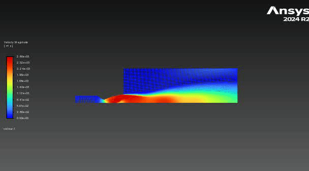

# Staged-Combustion-Project-
This repository will document my contributions to OSU Liquid Rocket Systems' next-generation staged combustion engine

I joined the staged combustion project in August of 2025 with nearly zero experience in Liquid propulsion systems design. 
This documents my journey to becoming an excellent propulsion engineer.

The first thing I did to officially join the team was to complete a CFD challenge, where I was meant to simulate a bell nozzle of a previous engine. 
I completed this sim as a means to learn about ANSYS Fluent and how bell nozzles work. 

-OXYGEN RICH RING PRE-BURNER   
    
    Upon joining the team, I was assigned to the Staged Combustion Project, 
     More specifically, I was assigned to design the pre-burner.
     At this point, I realized that I was in way over my head, 
     and decided to take every challenge head-on and learn as much as possible. 

-Injectors

    When designing injectors for the pre-burner, we decided to choose coaxial swirl injectors, as a senior member One 
    of the Liquid Rocket systems had made a tool to help size coaxial swirl injectors.
    Initially, I thought I could use this tool, and it would give dimensions of an optimal, fully functioning swirl injector. 
    I was very wrong and ended up making dozens of different geometries with only one that actually worked.
    It took me about 3 months of consistent design, simulation, physical testing, and iteration to finally find success. 
    Unfortunately, the day after I created the injector that worked, my entire hard drive was wiped for no apparent reason.
    That being said, I picked up where I left off and remade the working injector. I did lose many of the design iteration CAD and 
    simulation files, so much of the documentation for those is photos taken from the phone of my dirty laptop's screen.

-Injector CFD

    Unfortunately, due to my laptop's hard drive being corrupted, these photos were taken from my iPhone of my dirty laptop screen.

-real testing

    the image and GIF below show testing of one iteration of the coaxial swirl injector; the graph shows pressure against time. 

    
-Injector plate CAD

  

 -proof of concept flow test 
 
    This flow test was meant to validate my constant velocity manifold for fuel by demonstrating an even startup and 
    constant/even sustained flow through each injector

rough protoCAD of ring burner, still need a lot of calculations to refine geometry

 
 
 
This calculation shows how either combustion chamber will have to be drastically lengthened or increased in width.
For our pourposes we will likely just increase the width because the turbine shaft was designed for a much smaller length. 

Results from the fuel injector volute simulation show an even pressure distribution                                                  

Results from the Lox injector volute simulation show an even pressure distribution                                                    

New Redesign, with an increased stage 1 OF ratio for more stable combustion. 4 Lox tangental inlets for both stages, to ensure better pressure distribution. and geometry is optimized for reduction of materials and additive manufacturing. 

